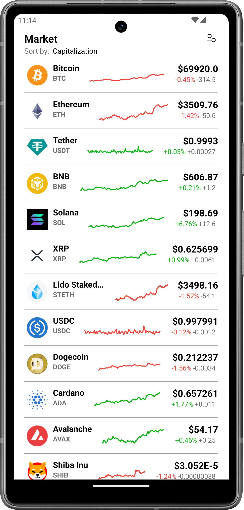
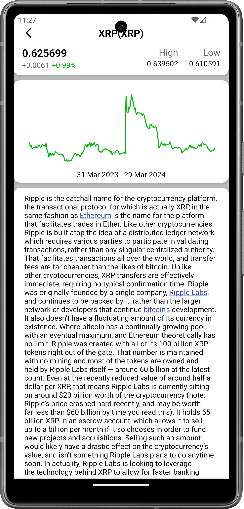

# Crypto Market App (Android)

Welcome to my Crypto Market App project! This Android application is designed to provide real-time cryptocurrency prices and basic details for various coins. It's part of my portfolio to showcase my skills in mobile app development using Kotlin.

## Overview

The Crypto Market App allows users to stay updated with real-time prices and essential details of cryptocurrencies. Users can easily track the performance of their favorite coins and make informed decisions about their investments.

<h2 align="left">

Screenshots
</h2>

## Features

- **Real-time Prices**: Get up-to-date prices for various cryptocurrencies.
- **Basic Coin Details**: View essential information about each coin, such as market cap, volume, and price change.
- **User-friendly Interface**: Simple and intuitive design for easy navigation and usage.

## Technologies Used

- **Language**: Kotlin
- **Development Platform**: Android Studio
- **API**: CoinGecko
- **Data Visualization**: jjoe64-GraphView

## Installation

The Crypto Market App is currently available for Android devices only. To install the app, follow these steps:

1. [Download Apk](https://manish99verma.github.io/my-portfolio/assets/apks/crypto-market.apk)
2. Enable installation from unknown sources in your device settings.
3. Install the APK file on your Android device.
4. Open the app and start exploring real-time cryptocurrency prices!

## Contact

For any inquiries or feedback, feel free to reach out to me at manish6203993@gmail.com
